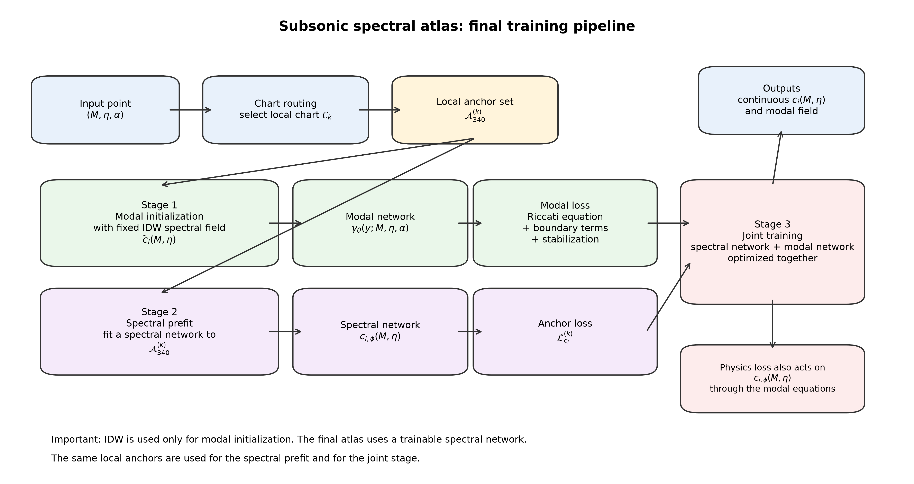
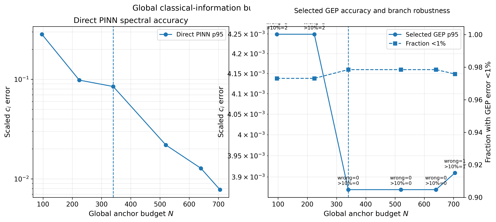
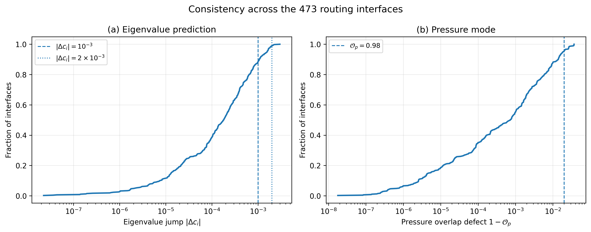
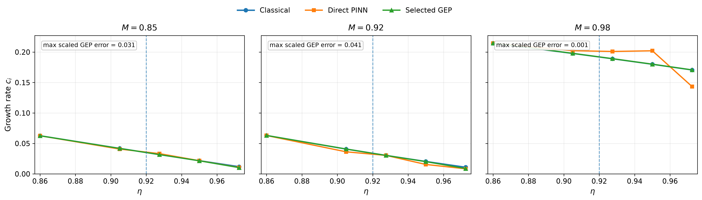

# Part I — Subsonic spectral branches

## Overview

Part I investigates the **subsonic spectral branches of the compressible
Kelvin–Helmholtz instability** using a hybrid workflow combining classical
spectral computation, sparse scalar supervision, physics-informed neural
representations, and dense generalized eigenvalue analysis.

The neural model is deliberately **not** used as a standalone replacement for
a classical eigensolver. Instead, sparse classical eigenvalues provide branch
information, while physics-informed training couples this scalar information
to locally constrained modal fields. A dense generalized eigenvalue problem
(GEP) is then diagonalized independently, and the neural scalar estimate is
used only to select the relevant discrete eigenpair after eigendecomposition.

The final reported discrete result is therefore the **selected dense-GEP
eigenpair**, while an independent **Riccati shooting solver** provides the
classical reference.

Part I contains:

- the validated subsonic classical reference;
- the production **49-chart piecewise-local neural atlas**;
- the retained **`N340` sparse-anchor configuration**;
- production neural checkpoints;
- the final dense-GEP implementation and scalar-guided eigenpair selection;
- fixed-Mach and atlas-wide ablations;
- residual, routing, seed, anchor-budget, near-neutral and runtime audits;
- **17 validated publication assets** and their machine-readable provenance.

---

## Scientific problem

The compressible Kelvin–Helmholtz instability is formulated as a
**non-self-adjoint eigenvalue problem** for the complex phase velocity

\[
c = c_r + i c_i.
\]

Part I focuses on the **subsonic regime**, where the unstable spectral branch
is characterized through the growth-rate component \(c_i\).

For the pressure perturbation \(\hat p(y)\), the governing equation is

\[
\hat p''
-
\frac{2U'}{U-c}\hat p'
-
\alpha^2
\left[
1-M^2(U-c)^2
\right]\hat p
=
0,
\]

where

- \(M\) is the Mach number,
- \(\alpha\) is the streamwise wavenumber,
- \(U(y)\) is the base-flow velocity profile,
- \(c\) is the complex phase velocity.

The first-order formulation used by the physics-informed model introduces

\[
q_p = \hat p',
\]

with residuals

\[
R_p = \hat p' - q_p,
\]

and

\[
R_{q_p}
=
q_p'
+
Pq_p
-
\alpha^2 R\hat p,
\]

where

\[
P=-\frac{2U'}{U-c},
\qquad
R=1-M^2(U-c)^2.
\]

Because the operator is non-self-adjoint, obtaining a small differential
residual is not sufficient to establish that a neural prediction belongs to
the desired classical spectral branch. Branch identification must therefore be
validated independently.

---

## Numerical strategy

The final Part I workflow deliberately separates the roles of classical
computation, machine learning, and discrete spectral analysis.

### 1. Independent classical reference

A robust **Riccati shooting solver** is used to construct the classical
subsonic reference branch.

The classical reference is used to:

- establish the target unstable branch;
- generate and validate sparse scalar anchors;
- evaluate spectral errors;
- assess difficult and near-neutral regions;
- compare retained modal quantities;
- audit neural predictions independently.

The classical reference remains independent of the neural atlas and of the
final dense-GEP eigenpair selection.

---

### 2. Sparse scalar supervision

The neural model receives only a sparse subset of classical growth-rate values.

The retained production atlas uses the **`N340` anchor budget**.

`N340` should be interpreted as the most robust empirical operating point
identified under the tested training, routing, and sampling protocol. It is
**not** claimed to be a theoretically optimal or universally minimal number of
anchors.

---

### 3. Piecewise-local neural atlas

The subsonic parameter domain is represented through **49 local neural
charts**.

Each chart couples:

- a scalar predictor for the local spectral branch;
- a physics-constrained modal representation;
- the pressure field and its first-order auxiliary quantity.

The atlas is **hard-routed**: a deterministic routing rule selects the active
chart associated with a query point.

The appropriate interpretation is therefore a

> **piecewise-local atlas of locally continuous neural charts**

rather than a globally smooth neural approximation of the complete parameter
domain.

---

### 4. Physics-informed modal representation

Sparse scalar supervision identifies the spectral branch locally, while the
physics-informed residual constrains the corresponding modal field between and
away from supervised points.

The direct neural mode is therefore interpreted as a
**differentially constrained local field representation**.

It is not used as a high-accuracy replacement for either the classical
eigenfunction or the final selected GEP eigenvector.

---

### 5. Independent dense GEP

For the final discrete spectral result, a dense generalized eigenvalue problem
is assembled and diagonalized independently of the neural prediction.

The scalar neural estimate is used **after eigendecomposition** to select the
relevant eigenvalue among the discrete GEP candidates.

The final reported discrete output is therefore the

> **scalar-guided selected GEP eigenpair**

and not the raw neural scalar or modal prediction.

This separation between branch information and final eigensolution is central
to the Part I methodology.

---

## Neural architecture

Each local neural chart contains coupled scalar and modal components.

The scalar component approximates the local growth-rate branch \(c_i\), while
the modal component represents the pressure solution and its associated
first-order field.

Training combines:

- sparse scalar supervision;
- differential physics residuals;
- boundary conditions;
- modal constraints;
- local sampling of the parameter domain.

The objective is not simply to interpolate \(c_i\), but to couple sparse
spectral information to a locally constrained solution of the governing
differential problem.

The production model should therefore be understood as a
**local branch-aware representation**, not as a globally continuous surrogate
eigensolver.

---

## Main scientific results

### Physics-only training does not identify the target branch

A reproducible no-data experiment was used to test whether differential
physics alone identifies either the desired branch or another admissible
classical branch.

Across **3 independent seeds** and **41 values of \(\alpha\)**:

- **0 / 123** raw neural predictions satisfy the classical matching condition
  at \(|F| < 10^{-2}\);
- the median classical mismatch at the neural predictions is approximately
  \(2.77\times10^{-1}\);
- classical reference roots give mismatches of approximately
  \(10^{-7}\)–\(10^{-6}\);
- no nearby alternative root-like minimum was identified.

The reproducible physics-only solution is therefore interpreted as a
**branch-identification failure**, not as evidence for a second admissible
spectral branch.

---

### Sparse scalar interpolation is already strong at fixed Mach number

A fixed-Mach control was used to determine whether the apparent effectiveness
of sparse supervision could simply be explained by the smooth one-dimensional
structure of \(c_i(\alpha)\).

Using four scalar anchors, a standard PCHIP interpolation gives a mean absolute
error of approximately

\[
5.34\times10^{-4},
\]

which is comparable to the retained historical four-anchor neural result.

The neural model is therefore **not required merely to interpolate a smooth
one-dimensional scalar curve**.

Its more relevant role is to connect sparse spectral information to
physics-constrained local modal fields.

---

### The main contribution of physics is modal consistency

Controlled comparisons between anchor-only and physics-informed training show
only a small and heterogeneous improvement in scalar accuracy.

Under the retained comparison, the scalar effect is of order **one percent**.

The more important contribution of the physics-informed term is the
**differential consistency of the local modal representation away from the
supervised scalar anchors**.

Part I therefore does not claim a large scalar-accuracy improvement from
physics alone.

---

### The atlas is locally, not globally, continuous

Routing consistency was audited across **473 actual chart interfaces**.

For the scalar prediction \(c_i\), the absolute interface jump has:

- median:
  \[
  1.794\times10^{-4},
  \]
- 95th percentile:
  \[
  1.579\times10^{-3},
  \]
- maximum:
  \[
  2.986\times10^{-3}.
  \]

For modal pressure overlap:

- median:
  \[
  0.999271,
  \]
- 5th percentile:
  \[
  0.981203,
  \]
- minimum:
  \[
  0.963109.
  \]

These results support **local cross-chart consistency**, but they do not
justify a claim of global continuity over the complete atlas.

---

### `N340` is the most robust tested sparse-anchor budget

The anchor-budget study shows that increasing supervision does not produce a
monotonic improvement.

Under the retained protocol:

- `N224` reproduces the same two catastrophic points across seeds;
- `N340` avoids catastrophic failures across the tested seeds;
- `N705` still exhibits a failure close to a sharp spectral transition.

`N340` is therefore retained as the most robust empirical compromise among the
tested configurations.

This conclusion is protocol-dependent and should not be interpreted as a
universal minimum sampling requirement.

---

### Dense-GEP accuracy remains resolution dependent near difficult points

The dense GEP is the final discrete eigensolver used in Part I, but it remains
a finite-dimensional approximation.

Dedicated near-neutral resolution audits compare increasing GEP resolutions
and show convergence of the selected eigenvalue at the tested difficult
points.

The analysis therefore explicitly distinguishes between:

1. neural branch information;
2. dense-GEP discretization error;
3. the independent Riccati shooting reference.

Neural guidance does not remove finite-resolution limitations of the GEP.

---

### No computational-speedup claim is made

The retained runtime benchmark gives approximately:

- Riccati shooting:
  \[
  1.9693\ \mathrm{s}
  \]
  median runtime;

- dense GEP plus scalar-guided selection:
  \[
  7.7982\ \mathrm{s}.
  \]

Under this benchmark, the GEP-based workflow is approximately

\[
3.96\times
\]

slower than the shooting calculation.

Part I therefore makes **no computational-speedup claim** for the final
dense-GEP workflow.

---

## Interpretation and limitations

The neural atlas should not be interpreted as a standalone high-accuracy
eigensolver.

The retained audits establish several important boundaries:

- physics-only training does not reliably identify the desired classical
  branch;
- sparse scalar interpolation is already strong in smooth fixed-Mach cuts;
- the main role of the physics-informed term is modal differential consistency,
  not a large scalar-accuracy improvement;
- the atlas is locally rather than globally continuous;
- `N340` is an empirical robust budget under the tested protocol, not a
  universal optimum;
- direct neural modes are constrained approximations, not replacements for
  classical eigenfunctions;
- the dense GEP retains finite-resolution errors near difficult and
  near-neutral points;
- the final GEP workflow is not faster than Riccati shooting in the retained
  benchmark.

These limitations are part of the scientific interpretation and are preserved
explicitly in the repository.

---

## Selected article assets

Part I contains **17 validated publication assets**, indexed by the
machine-readable
[`article/FIGURE_MANIFEST.csv`](article/FIGURE_MANIFEST.csv).

The following figures provide a compact visual summary of the Part I workflow.

### Classical subsonic reference


**Fig. 1 — Blumen isolines and classical Riccati shooting reference.**

The classical subsonic growth-rate branch is established independently with
the Riccati shooting solver and compared with the digitized Blumen reference.

---

### Spectral–modal workflow



**Fig. 2 — Spectral–modal workflow and independent GEP selection.**

The neural component couples sparse scalar spectral information to
physics-constrained local modal fields. The dense GEP is diagonalized
independently, and the scalar prediction is used only for eigenpair selection
after eigendecomposition.

---

### 49-chart neural atlas


**Fig. 3 — Geometry of the 49 locally continuous neural charts.**

The subsonic parameter domain is represented by a hard-routed,
piecewise-local atlas rather than by a single globally smooth network.

---

### Sparse-anchor budget



**Fig. 5 — Anchor-budget comparison.**

The retained `N340` configuration is the most robust empirical operating point
among the tested sparse-supervision budgets. It is not interpreted as a
universal minimum.

---

### Routing-interface consistency



**Fig. 6 — Deterministic routing-interface consistency.**

Scalar jumps and modal overlaps are evaluated across the actual boundaries
between neighboring charts. The audit supports local cross-chart consistency,
but not global continuity of the complete atlas.

---

### Representative modal reconstruction


**Fig. 8 — Representative direct-neural and selected-GEP modes at
\(M=0.5,\alpha=0.5\).**

The comparison illustrates the distinction between the differentially
constrained direct neural field and the final selected discrete GEP
eigenvector.

---

### Near-neutral behaviour



**Fig. 9 — Near-neutral growth-rate cuts.**

Difficult regions close to neutral stability expose the finite-resolution
limitations of the dense GEP and motivate the dedicated resolution audits
preserved in the repository.

The complete publication set, including supplementary classical convergence,
GEP-resolution, spectral-error and modal-error figures, is documented in
[`article/FIGURE_MANIFEST.csv`](article/FIGURE_MANIFEST.csv).

---

## Repository structure

```text
Part_I/
├── article/              # publication manifest and article-facing material
├── assets/               # validated scientific data and canonical figures
├── code/
│   ├── configs/          # canonical production/runtime configurations
│   ├── plots/
│   │   ├── article/      # publication wrappers and validators
│   │   └── generators/   # figure/data generators
│   ├── slurm/            # supported HPC launchers
│   └── src/              # active scientific implementation
├── experiments/          # ablations, controls and scientific audits
├── models_saved/         # production checkpoints and integrity metadata
├── provenance/           # historical, migration and exclusion records
├── tests/                # lightweight CPU regression tests
├── PROJECT_STRUCTURE.md
├── README.md
├── REPRODUCIBILITY.md
└── requirements.txt
```

The active classical subsonic solvers live under

```text
code/src/scripts/classical/
```

The canonical dense-GEP implementation and eigenpair-selection logic used in
Part I live under

```text
code/src/scripts/gep/
```

The production atlas configuration and routing information are stored under

```text
code/configs/
```

Scientific ablations and reviewer-style audits are grouped under

```text
experiments/
```

Historical implementations, migration records, and explicitly non-active
material are isolated under

```text
provenance/
```

and are not part of the active computational workflow.

---

## Installation

From `Part_I/`, create and activate a Python environment appropriate for the
target CPU/GPU platform:

```bash
python3 -m venv .venv
source .venv/bin/activate

python -m pip install --upgrade pip
python -m pip install -r requirements.txt

export PYTHONPATH="$PWD/code${PYTHONPATH:+:$PYTHONPATH}"
```

The public requirements are intentionally not fully version-pinned.

For exact platform-specific or HPC reproduction, refer to
[`REPRODUCIBILITY.md`](REPRODUCIBILITY.md).

---

## Quick start

A small classical subsonic calculation can be launched with

```bash
python code/src/scripts/classical/solve_robust_subsonic_shooting.py \
  --alpha 0.5 \
  --mach 0.5
```

For atlas routing, checkpoint-based neural evaluation, dense-GEP selection, and
article-asset reproduction, use the verified workflows documented in
[`REPRODUCIBILITY.md`](REPRODUCIBILITY.md).

---

## Reproducibility

Part I distinguishes several levels of reproducibility, ranging from
lightweight repository validation to classical recomputation, checkpoint-based
neural inference, and expensive training/HPC workflows.

The canonical instructions are provided in:

- [`REPRODUCIBILITY.md`](REPRODUCIBILITY.md) — supported computational
  workflows;
- [`PROJECT_STRUCTURE.md`](PROJECT_STRUCTURE.md) — public repository contract;
- [`article/README.md`](article/README.md) — publication-asset workflow;
- [`article/FIGURE_MANIFEST.csv`](article/FIGURE_MANIFEST.csv) —
  machine-readable figure provenance;
- [`experiments/EXPERIMENTS.md`](experiments/EXPERIMENTS.md) — retained
  scientific audits and ablations.

---

## Tests

The lightweight Part I regression suite can be run from the repository root
with

```bash
python -m pytest -q Part_I/tests
```

or from inside `Part_I/` with

```bash
python -m pytest -q tests
```

The current public suite contains **7 lightweight CPU regression tests**.

---

## Models and checkpoints

Production neural checkpoints used by the retained atlas are stored under
[`models_saved/`](models_saved/).

Checkpoint inventory, integrity information, loading conventions, and routing
metadata are documented in
[`models_saved/README.md`](models_saved/README.md).

The checkpoints are retained for inference and reproducibility; historical or
non-production model states are not part of the active workflow.

---

## Article assets

The curated Part I publication layer is indexed by
[`article/FIGURE_MANIFEST.csv`](article/FIGURE_MANIFEST.csv).

Canonical figure files and their scientific source data are retained under
[`assets/`](assets/) and, where appropriate,
[`experiments/`](experiments/).

The current publication layer contains **17 validated manuscript assets**.

The figure manifest is the authoritative mapping between:

- article labels;
- canonical figure files;
- generating scripts;
- source data;
- SHA-256 integrity hashes;
- figure-specific notes.

---

## Citation

Formal citation metadata will be added once the associated publication metadata
is finalized.

Until then, when using the code, figures, or numerical results, please cite the
corresponding article or the repository URL.

---

## License

This repository is distributed under the **BSD 3-Clause License**.

See the repository-level [`LICENSE`](../LICENSE) file for details.
