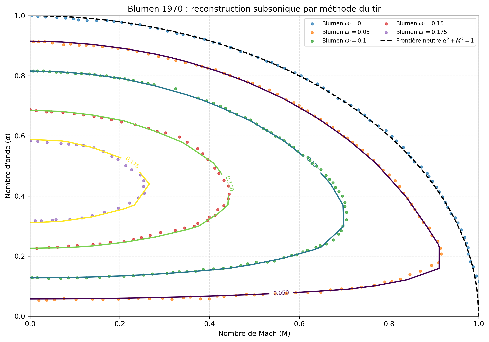
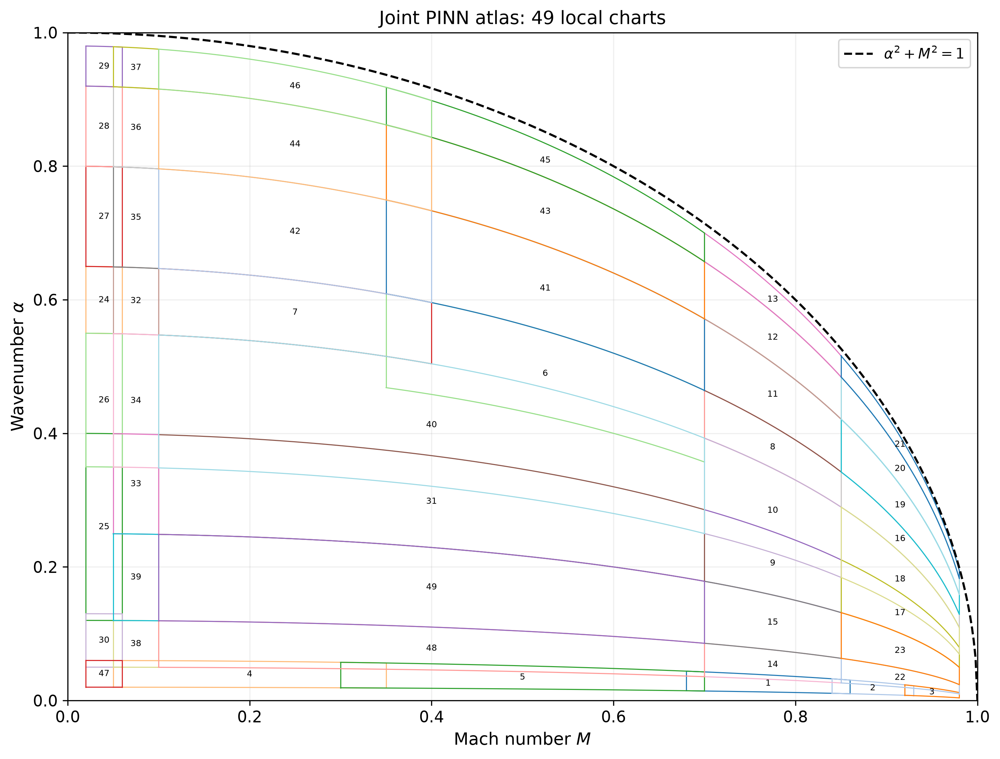
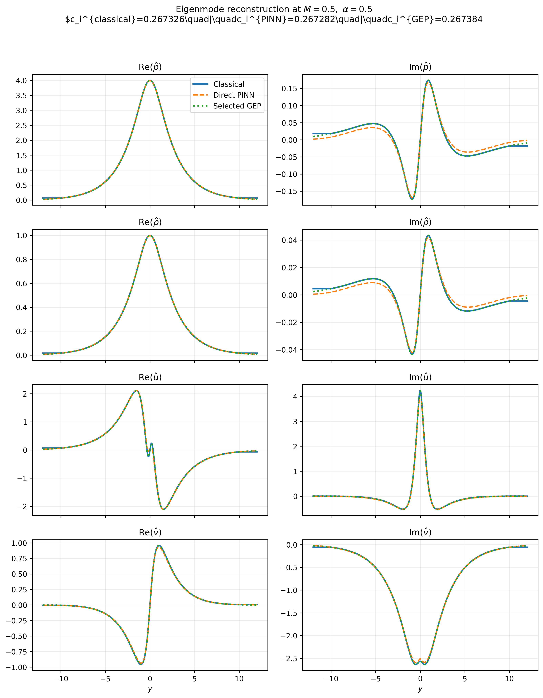
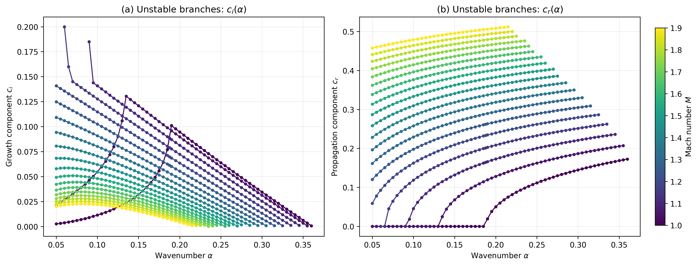
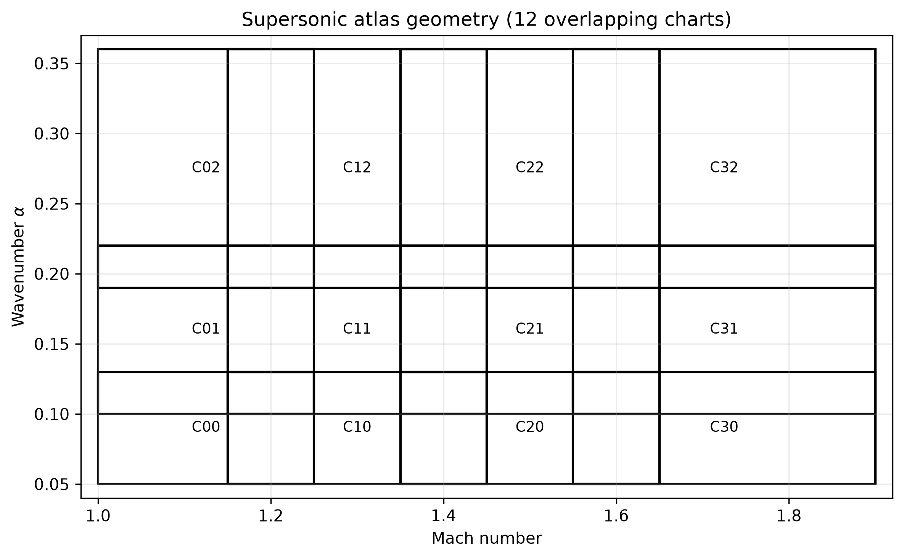
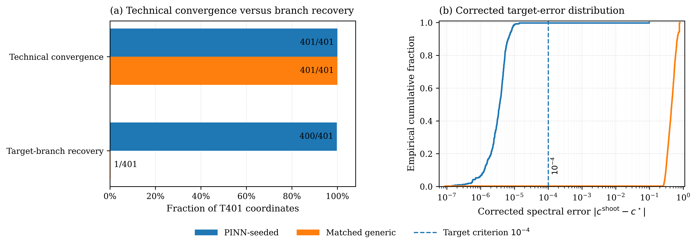

# Compressible Kelvin–Helmholtz eigenvalues and eigenmodes with physics-informed neural networks

This repository studies the **compressible Kelvin–Helmholtz instability as a
non-self-adjoint eigenvalue problem**, with a particular focus on the role that
physics-informed neural networks can play in **spectral branch localization,
sparse-data reconstruction, and modal representation**.

The work is divided into two complementary studies:

- **Part I — Subsonic spectral branches**
- **Part II — Supersonic spectral branches**

In both cases, neural predictions are evaluated against independent classical
spectral calculations. The repository does **not** treat a low physics residual
as sufficient evidence of correct branch recovery, and the neural models are
not presented as unconditional replacements for classical eigensolvers.

---

## Physical problem

For a complex phase velocity

\[
c = c_r + i c_i,
\]

the pressure perturbation \(\hat p(y)\) satisfies

\[
\hat p''
-
\frac{2U'}{U-c}\hat p'
-
\alpha^2
\left[
1-M^2(U-c)^2
\right]\hat p
=
0,
\]

where \(M\) is the Mach number, \(\alpha\) the streamwise wavenumber, and
\(U(y)\) the base-flow velocity profile.

Because the resulting operator is **non-self-adjoint**, spectral branch
identification is a central numerical difficulty. A small differential
residual alone does not guarantee that a predicted eigenvalue belongs to the
desired classical branch.

---

## Two complementary regimes

| | **Part I — Subsonic** | **Part II — Supersonic** |
|---|---|---|
| Spectral quantity | primarily \(c_i\) | complex \((c_r,c_i)\) |
| Classical reference | Riccati shooting | Riccati shooting |
| Neural representation | 49-chart piecewise-local atlas | 12-chart piecewise-local atlas |
| Sparse configuration | `N340` | `N76` |
| Neural role | local branch representation and physics-constrained modal field | complex branch localization and shooting initialization |
| Final eigensolution | selected dense-GEP eigenpair | converged Riccati-shooting eigenpair |
| Main caution | no global-continuity or speedup claim | no claim that PINN output is the final eigensolution |

---

# Part I — Subsonic spectral branches

[`Part_I/`](Part_I/) studies the subsonic unstable branch using:

- an independent Riccati-shooting reference;
- sparse scalar eigenvalue anchors;
- a **49-chart piecewise-local neural atlas**;
- physics-informed modal constraints;
- independent dense generalized eigenvalue analysis;
- scalar-guided eigenpair selection;
- routing, anchor-budget, residual, seed, near-neutral, modal, and runtime
  audits.

The production atlas retains the **`N340` sparse-anchor configuration**.

The final discrete result is the **selected dense-GEP eigenpair**. The neural
model provides branch information and a differentially constrained local modal
representation; it is not used as the final high-accuracy eigensolver.

### Classical reference



### Piecewise-local neural atlas



### Representative neural and GEP modes



**Documentation:**  
[Part I README](Part_I/README.md) ·
[Reproducibility](Part_I/REPRODUCIBILITY.md) ·
[Project structure](Part_I/PROJECT_STRUCTURE.md) ·
[Figure manifest](Part_I/article/FIGURE_MANIFEST.csv)

---

# Part II — Supersonic spectral branches

[`Part_II/`](Part_II/) extends the study to the supersonic propagative regime,
where both

\[
c_r
\qquad\text{and}\qquad
c_i
\]

must be localized.

The workflow combines:

- an independent classical Riccati-shooting reference;
- comparison with digitized Blumen data;
- sparse complex-eigenvalue anchors;
- a **12-chart piecewise-local neural atlas**;
- physics-informed modal constraints;
- PINN-informed spectral localization;
- final **PINN-seeded Riccati shooting**;
- classical eigenmode reconstruction;
- branch-recovery, failure-basin, routing, multiseed, residual,
  threshold-sensitivity, and computational-cost controls.

The production spectral atlas retains the **`N76` sparse-anchor
configuration**.

The final high-accuracy eigenvalue and eigenmode are obtained from the
**classical Riccati-shooting solver**. The neural atlas is used to localize or
initialize the spectral search rather than to replace the final classical
solve.

### Complex supersonic branch



### Piecewise-local atlas



### PINN-informed versus generic shooting



**Documentation:**  
[Part II README](Part_II/README.md) ·
[Reproducibility](Part_II/REPRODUCIBILITY.md) ·
[Project structure](Part_II/PROJECT_STRUCTURE.md) ·
[Figure manifest](Part_II/article/FIGURE_MANIFEST.csv)

---

## Scientific interpretation

Across both parts, the central question is not simply whether a neural network
can fit an eigenvalue surface.

The repository instead separates several distinct issues:

1. **spectral branch identification**;
2. **sparse-data reconstruction**;
3. **differential consistency of neural modal fields**;
4. **local versus global continuity of piecewise neural representations**;
5. **accuracy of the final classical or discrete eigensolver**;
6. **computational cost and robustness**.

This separation is particularly important for non-self-adjoint problems,
where a smooth prediction or a small physics residual need not correspond to
the desired admissible spectral branch.

---

## Repository layout

```text
.
├── Part_I/                 # subsonic spectral branches
├── Part_II/                # supersonic spectral branches
├── .github/                # lightweight continuous-integration checks
├── LICENSE                 # BSD 3-Clause License
├── PROJECT_STRUCTURE.md    # repository-wide organizational contract
├── README.md
└── REPRODUCIBILITY.md      # entry point to both reproducibility guides
```

The two scientific parts are intentionally kept separate.

Each part owns its own:

- classical and neural implementations;
- configurations;
- scientific assets;
- experiments and audits;
- article figures;
- provenance;
- reproducibility instructions.

Scientific assets and executable implementations are not implicitly shared
between the subsonic and supersonic workflows.

---

## Reproducibility

The repository contains lightweight CPU regression tests, publication-asset
manifests, integrity checks, classical reference workflows, retained neural
inference paths, and documentation for more expensive training or HPC
experiments.

Start from:

- [`REPRODUCIBILITY.md`](REPRODUCIBILITY.md) for the repository-wide entry
  point;
- [`Part_I/REPRODUCIBILITY.md`](Part_I/REPRODUCIBILITY.md) for the subsonic
  workflow;
- [`Part_II/REPRODUCIBILITY.md`](Part_II/REPRODUCIBILITY.md) for the supersonic
  workflow.

The current publication layers contain:

- **17 validated Part I figures**;
- **25 validated Part II figures**.

Their machine-readable provenance is recorded in the corresponding
`FIGURE_MANIFEST.csv` files.

---

## Citation

Formal citation metadata will be added once the associated publication
metadata is finalized.

Until then, when using code, figures, or numerical results from this
repository, please cite the corresponding Part I or Part II article together
with this repository.

---

## License

This repository is distributed under the **BSD 3-Clause License**.

See [`LICENSE`](LICENSE) for details.
